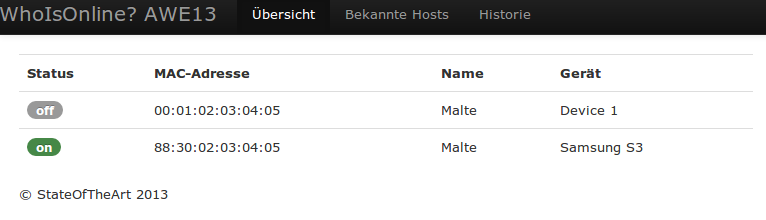
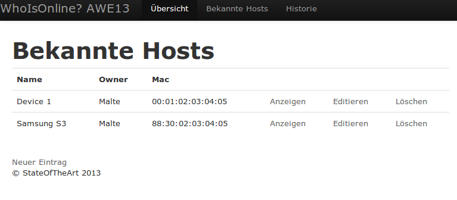

AWE13-Exercise-1
================

First try with ruby on rails and twitter bootstrap. 
It's a little network statistics tool, which shows online hosts and logs their uptime.

## Requirements ##

- crontab
- nmap
- whenever

## How to install ##

	bundle install
	whenever -w
	rails server

## Screenshots ##

### Overview ###

### List of known hosts ###

